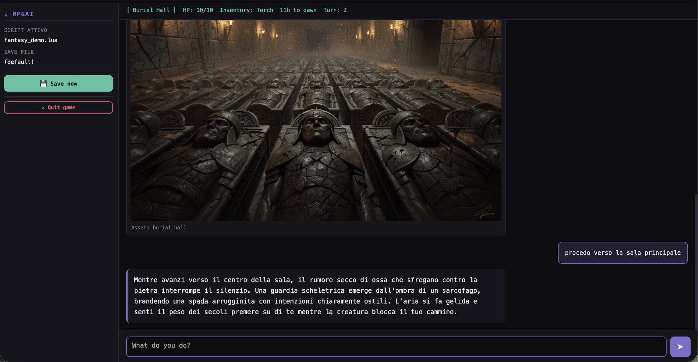

# ⚔ RpgAi

[](https://opensource.org/licenses/MIT)
[](https://en.cppreference.com/w/cpp/17)
[]()
[](https://luajit.org/)

> *The dungeon master never sleeps. The story never ends.*

**RpgAi** is an open-source engine that turns any Large Language Model into a living, breathing game master for text-based RPGs. Write your world in Lua. Let the AI narrate it.

---

## What is this?

RpgAi is a C++ engine that bridges **Lua game scripts** and **LLM providers** to create immersive, dynamic text adventures. The game world — characters, locations, rules, relationships — lives entirely in a Lua script you write. The engine feeds the current game state to the LLM of your choice, which narrates the outcome, drives NPC behaviour and keeps the story coherent turn after turn.

Whether you want to recreate a classic D&D dungeon crawl, build an interactive mystery novel, or design a slice-of-life social simulator, RpgAi gives you the tools without locking you into any particular story structure or AI provider.



---

## ✨ Features

**For players and storytellers**
- 🎲 **Any genre, any setting** — fantasy, sci-fi, horror, romance, historical. If you can describe it in Lua, the AI can narrate it
- 🧠 **Persistent world state** — NPCs move, relationships evolve, time passes. The game remembers everything
- 🌐 **Beautiful web UI** — play in your browser with a clean dark interface; no terminal required
- 🖼 **AI-generated scene images** — automatic scene illustration via image models (WaveSpeed, fal.ai, OpenRouter and more)
- 🔊 **AI voice narration** — optional local TTS server (Coqui XTTS v2) for zero-shot voice cloning; pipeline playback in the browser so generation and audio overlap seamlessly
- 💾 **Save & load** — full session persistence with JSONL save files
- 📖 **RAG narrative style** — feed the engine example narrations to lock in the tone and prose style of your world

**For developers and world-builders**
- 🔌 **Multi-provider LLM support** — Ollama (local), OpenRouter, Gemini, OpenAI, Claude, or any OpenAI-compatible endpoint
- 🖊 **Lua scripting** — simple, readable scripts define everything: locations, NPCs, game rules, JSON schema, commands
- ⚡ **LuaJIT powered** — fast Lua execution with full access to the C++ engine via exposed functions
- 🔧 **Hackable C++ core** — clean header-based architecture designed to be extended
- 🗂 **Smart image cache** — scene images cached by composition key; unchanged scenes reuse existing renders
- 🔁 **In-game commands** — `/fix`, `/observe`, `/summary`, `/image` and custom Lua commands in both console and web mode
- 🖥 **Local AI servers** — optional Python servers for local image generation (Qwen-Image-Edit-2511) and TTS (XTTS v2), manageable from the web UI (install deps, start, stop)

---

## 🚀 Quick start

```bash
# 1. Clone
git clone https://github.com/yourusername/RpgAi.git
cd RpgAi

# 2. Install system dependencies (macOS)
brew install luajit asio curl cmake

# 3. Place header-only dependencies in vendor/  (see docs/installation.md)

# 4. Build
./build.sh

# 5. Run with Ollama (local, no API key needed)
./build/rpgai --web --provider ollama --model llama3 --path scripts/
```

Then open **http://localhost:8080**, select a script and start playing.

For full installation instructions, troubleshooting and first-run examples, see **[docs/installation.md](docs/installation.md)**.

---

## 🏗 Architecture

> **A note on authorship:** roughly 90% of the C++ and Lua code in this repository was written by [Claude](https://claude.ai) (Anthropic's AI assistant) through an extended pair-programming session. Architecture, design decisions and feature roadmap were directed by the human author.

### Repository layout

```
RpgAi/
├── src/
│   ├── main.cpp          # Engine core, CLI, web server, game loop
│   ├── llm_query.h       # LLM provider abstraction (Ollama, OpenRouter, Gemini…)
│   ├── llm_image.h       # Image generation, collage builder, scene cache
│   └── web_page.h        # Embedded single-page web UI (HTML/CSS/JS)
├── scripts/
│   ├── fantasy_demo.lua  # Demo adventure — classic fantasy
│   └── lib/              # Shared Lua libraries (json, json_repair)
├── tts_locale/
│   ├── server.py         # FastAPI TTS server (Coqui XTTS v2, port 8004)
│   ├── patch_tts_compat.py  # Compatibility patches for PyTorch 2.6+ / transformers 4.37+
│   └── test_tts.py       # CLI test script (--url for remote servers)
├── qwen_locale/
│   └── server_locale.py  # FastAPI image server (Qwen-Image-Edit-2511, port 8000)
├── docs/                 # Extended documentation
├── vendor/               # Header-only dependencies (see docs/installation.md)
├── CMakeLists.txt
└── build.sh
```

### Core components

**`main.cpp`** — engine heart. CLI parsing, LuaJIT lifecycle, Crow web server (14 routes), console game loop, async image job system, RAG engine, session persistence.

**`llm_query.h`** — single abstraction for all text generation providers behind one function: `query_llm(provider, sys_prompt, history, user_prompt, json_schema, model)`. Supported providers: Ollama, OpenRouter, Gemini, OpenAI, Claude, any OpenAI-compatible endpoint.

**`llm_image.h`** — everything visual: asset collage builder, text-to-image, image-to-image, scene cache. Providers: stable-diffusion.cpp, OpenAI, OpenRouter, fal.ai, WaveSpeed, DashScope, AIMLAPI, Qwen local. t2i and i2i can use different providers independently.

**`web_page.h`** — the entire single-page application as a C++ raw string literal. No build step, no bundler — Crow serves it directly from memory.

### Data flow — one game turn

```
Player input
     │
     ▼
process_player_input()    ← Lua: handles /commands
     │
     ▼
get_status_for_ai()       ← Lua: world state → JSON
get_system_prompt()       ← Lua: current system prompt
get_json_schema()         ← Lua: schema LLM must follow
     │
     ▼
[RAG injection]           top-N style examples added to system prompt
     │
     ▼
query_llm()               HTTP to LLM provider
     │
     ▼
process_ai_response()     ← Lua: validate JSON, update state, return narration
     │
     ▼
write_turn()              save to disk
     │
     ▼
narration + updated HUD → player
```

### Design philosophy

**The engine is dumb; the script is smart.** C++ handles IO, HTTP, LLM calls and persistence. Everything that makes your adventure *yours* lives in Lua — change it without recompiling.

**The LLM is a narrator, not a rules engine.** The JSON schema your script defines constrains what the LLM can do. It cannot invent new locations or ignore the time system — schema and Lua validation enforce the rules. The LLM's job is to write compelling prose within those constraints.

**Fail gracefully.** Every LLM call retries up to `--max-retries`. Image generation is async and non-blocking. Missing assets are generated on demand.

### Lua agents — secondary LLM calls from script

Because `query_llm` is exposed directly to Lua, your script can make **additional, independent LLM calls** at any point — not just inside the main GM turn. These secondary calls are called *agents* and follow a simple pattern: read `state`, call `query_llm` with a focused prompt and a tight JSON schema, then apply the result directly to `state`.

Agents run in the same Lua state as the rest of the script, so they have full access to all game data and can modify it freely. The engine imposes no structure — each agent decides for itself when to activate, what to ask, and what to change.

```lua
-- Example: a world-events agent that fires once per in-game day
local function world_events_agent(minuti_avanzati)
    if state.giorno == state._last_event_day then return end   -- already ran today
    state._last_event_day = state.giorno

    local schema = '{"type":"object","required":["evento","desc"],' ..
                   '"properties":{"evento":{"type":"string"},"desc":{"type":"string"}}}'
    local ok, reply = pcall(query_llm,
        "You are a world event generator for a summer Italian city RPG.",
        "[]",
        "Generate a small background event for today: a market, a street musician, "
     .. "a shop closure, a local festival. Keep it grounded and brief.",
        schema)
    if not ok then return end

    local ok2, data = pcall(json.decode, reply)
    if ok2 and data.evento ~= "" then
        state.evento_giorno = data
        push_log("📰 " .. data.evento)
    end
end

-- Called wherever makes sense — inside process_ai_response, a slash command, etc.
-- No central dispatcher required.
```

Common agent patterns:

| Agent | When to fire | LLM needed? |
|---|---|---|
| NPC needs (hunger, sleep, …) | every turn, deterministic | no |
| Relationship natural drift | day rollover | no |
| World events | day rollover | yes (small schema) |
| NPC gossip propagation | after a public action | yes |
| Dream generation | night / day rollover | yes |
| Rival NPC with own goals | every few turns | yes |
| Economy / shop prices | weekly | no |

**Performance note:** each `query_llm` call inside an agent is synchronous and blocks the Lua mutex in web mode. Keep LLM agents rare (day-boundary events, significant triggers) and prefer deterministic logic for per-turn updates.

### Tool calling — LLM-driven game mechanics

Tool calling lets the LLM invoke Lua functions mid-narration. Instead of having the GM invent a dice result, it calls `roll_dice` and gets a real one. Instead of guessing inventory, it calls `inventory_check`. The engine handles the back-and-forth automatically; the script just declares which tools are available.

Enable tool calling by implementing the optional `get_tools()` function:

```lua
local tools = require("lib/tools")

function get_tools()
    return tools.build({
        tools.roll_dice(state),
        tools.skill_check(state),
        tools.inventory_check(state),
        tools.buy_item(state, SHOP_PRICES),
    })
end
```

`scripts/lib/tools.lua` ships these pre-built tools:

| Tool | What it does |
|---|---|
| `roll_dice` | Roll N dice with S sides, return total + individual rolls |
| `skill_check` | d20 + player skill bonus vs difficulty, flags crit/fumble |
| `inventory_check` | How many of an item the player has |
| `buy_item` | Atomic purchase: deducts gold or returns failure |
| `sell_item` | Atomic sale: adds gold only if player has the item |
| `query_state` | Expose any Lua table field to the LLM on demand |

Custom tools follow the same `{ name, description, params, fn }` schema — `params` is a JSON Schema string, `fn` is a Lua function that receives a JSON args string and returns a JSON result string.

Scripts without `get_tools()` work exactly as before — the engine falls back to standard single-turn LLM calls.

---

## 🖥 Local servers

RpgAi can offload image generation and TTS to optional Python servers running on the same machine or a remote GPU box. All servers are managed from the **Settings → Local Servers** tab in the web UI — install dependencies, start and stop with one click.

### TTS locale server (`tts_locale/server.py`)

Provides zero-shot voice cloning using **Coqui XTTS v2**. Upload a 6–30 second reference WAV and the model synthesises new speech in that voice.

```bash
# Install deps (or use the web UI Install button)
pip install transformers==4.36.2 TTS torchaudio soundfile numpy fastapi uvicorn python-multipart

# Apply compatibility patches for PyTorch 2.6+ and transformers 4.37+
python tts_locale/patch_tts_compat.py

# Start
python tts_locale/server.py --host 0.0.0.0
```

Key options: `--temperature` (voice similarity, default 0.2), `--strip-silence` (clean reference WAV before embedding), `--clean-text` (strip markdown before synthesis), `--device cuda|mps|cpu`.

Once running, configure the narrator voice in Settings → Local Servers → TTS. The web UI fetches audio in sentence-sized chunks fired in parallel — sentence N+1 is generated while sentence N is playing, keeping latency low on long narrations.

### Qwen locale server (`qwen_locale/server_locale.py`)

Provides local image-to-image scene rendering using **Qwen-Image-Edit-2511** (DiT ~14B, BF16). Designed for RTX 5090 / 32 GB VRAM with `--cpu-offload`; works on smaller cards with appropriate quantization flags.

```bash
# Recommended launch for RTX 5090
python qwen_locale/server_locale.py \
  --dtype bf16 --host 0.0.0.0 --lightning --fast --cpu-offload
```

Set the server URL in **Settings → Image I2I → URL** (e.g. `http://192.168.1.x:8000`). The engine uses it automatically for `/image` commands.

---

## 📚 Documentation

| Doc | Contents |
|---|---|
| [docs/installation.md](docs/installation.md) | System deps, header-only libs, build, troubleshooting, first run |
| [docs/cli-reference.md](docs/cli-reference.md) | All CLI flags, in-game commands, full example config |
| [docs/scripting.md](docs/scripting.md) | Lua script guide, required functions, patterns, demo script |
| [docs/images.md](docs/images.md) | Image system, asset pipeline, render modes, provider details |

---

## 🗺 Roadmap

- [ ] `--port` flag to configure the web server port
- [ ] Multi-session web mode (multiple simultaneous players)
- [ ] Two-level scene cache (hard key + soft narrative key for smart i2i reuse)
- [ ] WebSocket streaming for real-time narration display
- [x] Narrator TTS — local Coqui XTTS v2 server; pipeline sentence playback; web UI voice selector
- [ ] Per-NPC voice cloning — Lua `get_npc_voices()` to assign voice profiles to characters
- [ ] Script hot-reload in web mode
- [ ] Issue templates for bug reports and feature requests

---

## 🤝 Contributing

Pull requests are welcome — whether you're fixing a C++ bug, adding a new LLM provider, improving the web UI, or sharing a Lua adventure script. See [CONTRIBUTING.md](CONTRIBUTING.md) for guidelines.

---

## 📄 License

MIT License — see [LICENSE](LICENSE).

```
Copyright (c) 2025 Massimo Bernava
```

*Built with C++17 · LuaJIT · sol2 · Crow · nlohmann/json · libcurl · stb · ollama-hpp*

*~90% of the code written by [Claude](https://claude.ai) (Anthropic) · Architecture and direction by Massimo Bernava*
